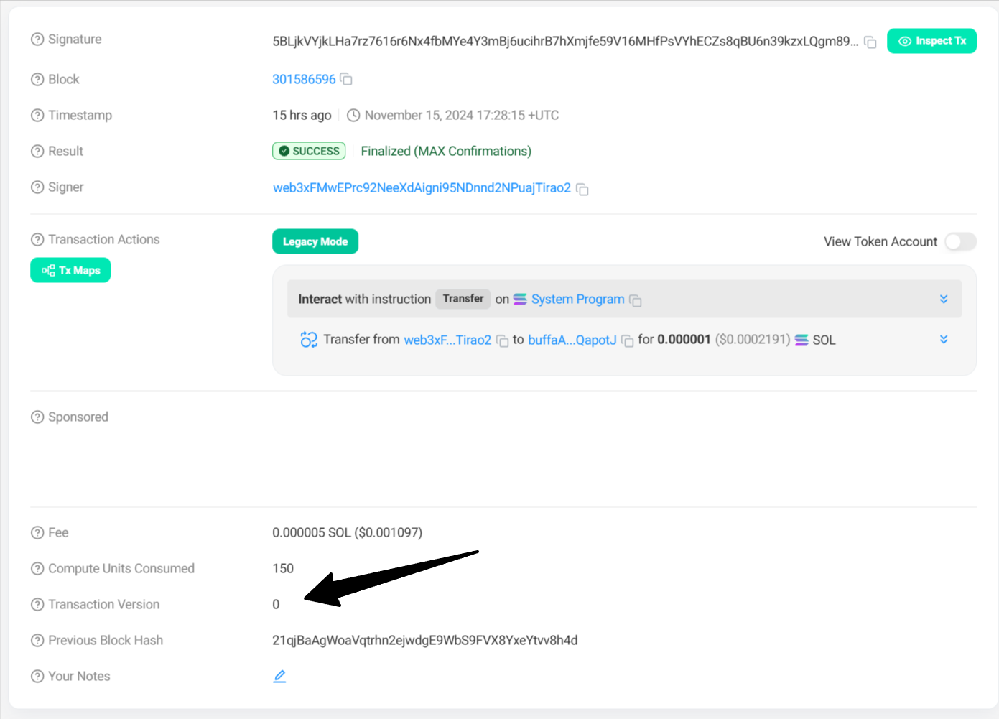
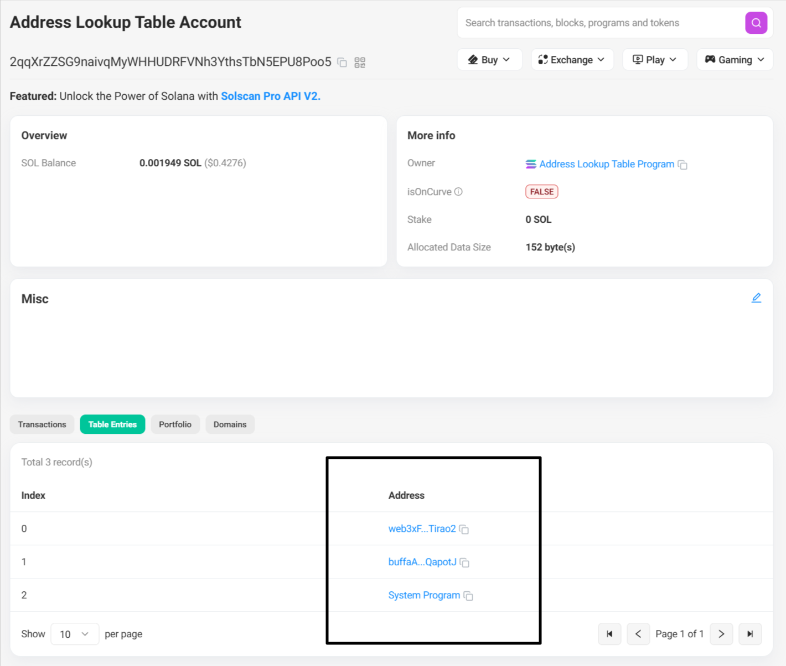
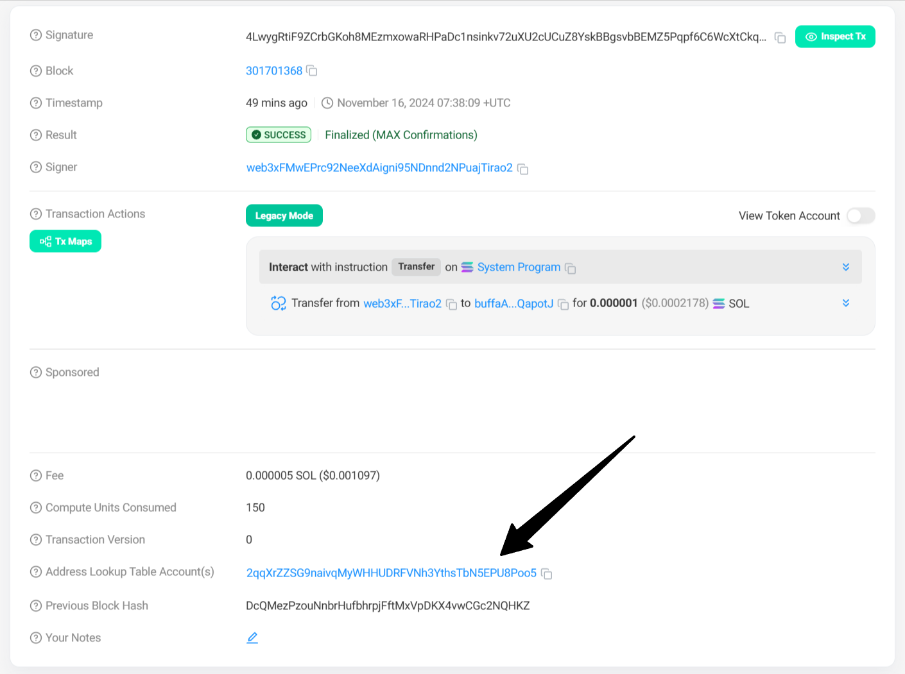

# `v0` 交易

版本化交易（Versioned Transactions）或称 `v0` 交易是Solana更新过程中引入的一种新的交易类型。因传统（legacy）交易账户数量的限制，`v0` 交易中引入了地址查找表（Address Lookup Tables）功能，用于压缩账户数量，将账户数量限制由35个提升到了64个。

> `v0` 交易在链上套利场景中被广泛应用。

本节将讲解如何创建`v0` 交易和如何使用地址查找表。

## 创建`v0` 交易

以下是创建 `v0`交易的示例。

> 如无特殊要求，推荐所有交易都使用 `v0` 类型。

```ts
import {
    Connection,
    PublicKey,
    Keypair,
    TransactionMessage,
    VersionedTransaction,
    SystemProgram,
} from '@solana/web3.js';
import fs from "fs";

// 创建RPC连接
const connection = new Connection("https://api.mainnet-beta.solana.com", "confirmed");

// 本地导入钱包
// const fromSecretKey = Uint8Array.from(JSON.parse(fs.readFileSync("wallet.json")));
const fromSecretKey = Uint8Array.from(JSON.parse(fs.readFileSync("web3xFMwEPrc92NeeXdAigni95NDnnd2NPuajTirao2.json")));
const fromWallet = Keypair.fromSecretKey(fromSecretKey);
```

```ts
async function main() {

    // 目标地址
    const toAddress = new PublicKey('buffaAJKmNLao65TDTUGq8oB9HgxkfPLGqPMFQapotJ');

    // 转账指令
    const instruction = SystemProgram.transfer({
        fromPubkey: fromWallet.publicKey,
        toPubkey: toAddress,
        lamports: 1000, // 1000 lamports
    });

    // 创建v0 message
    const { blockhash } = await connection.getLatestBlockhash();
    const messageV0 = new TransactionMessage({
        payerKey: fromWallet.publicKey,
        recentBlockhash: blockhash, // 最近的区块hash
        instructions: [instruction], // 指令数组
    }).compileToV0Message();

    // 创建v0交易并签名
    const transaction = new VersionedTransaction(messageV0);
    transaction.sign([fromWallet]);

    // 模拟交易
    const simulateResult = await connection.simulateTransaction(transaction);
    console.log("模拟交易结果: ", simulateResult);

    // 发送交易
    const signature = await connection.sendTransaction(transaction);
    console.log(`交易已发送: https://solscan.io/tx/${signature}`);
}

main();
```

通过运行 `npx esrun 08-v0/index.ts`，输出如下：

```
模拟交易结果:  {
  context: { apiVersion: '2.0.3', slot: 301586586 },
  value: {
    accounts: null,
    err: null,
    innerInstructions: null,
    logs: [
      'Program 11111111111111111111111111111111 invoke [1]',
      'Program 11111111111111111111111111111111 success'
    ],
    replacementBlockhash: null,
    returnData: null,
    unitsConsumed: 150
  }
}
交易已发送: https://solscan.io/tx/5BLjkVYjkLHa7rz7616r6Nx4fbMYe4Y3mBj6ucihrB7hXmjfe59V16MHfPsVYhECZs8qBU6n39kzxLQgm89pQ8k1
```

区块链浏览器中可以[查看此交易](https://solscan.io/tx/5BLjkVYjkLHa7rz7616r6Nx4fbMYe4Y3mBj6ucihrB7hXmjfe59V16MHfPsVYhECZs8qBU6n39kzxLQgm89pQ8k1)的版本。



## 地址查找表

通过与 `AddressLookupTableProgram` 进行交互，可以创建自己的地址查找表并在交易中引入自己的查找表。

### 创建ALT

```ts
import {
    Connection,
    PublicKey,
    Keypair,
    TransactionMessage,
    VersionedTransaction,
    SystemProgram,
    AddressLookupTableProgram
} from '@solana/web3.js';
import fs from "fs";

// 创建RPC连接
// const connection = new Connection("https://api.mainnet-beta.solana.com", "confirmed");
// const connection = new Connection("https://mainnet-ams.chainbuff.com", "confirmed");
const connection = new Connection("https://chrissy-w0sbco-fast-mainnet.helius-rpc.com", "confirmed");

// 本地导入钱包
// const fromSecretKey = Uint8Array.from(JSON.parse(fs.readFileSync("wallet.json")));
const secretKey = Uint8Array.from(JSON.parse(fs.readFileSync("web3xFMwEPrc92NeeXdAigni95NDnnd2NPuajTirao2.json")));
const payer = Keypair.fromSecretKey(secretKey);
```

```ts
async function createALT() {

    // 获取当前slot
    const slot = await connection.getSlot("confirmed");

    // 创建ALT
    const [lookupTableInstruction, lookupTableAddress] =
        AddressLookupTableProgram.createLookupTable({
            authority: payer.publicKey,
            payer: payer.publicKey,
            recentSlot: slot,
        });

    console.log("lookup table address:", lookupTableAddress.toBase58());

    // 创建v0 message
    const { blockhash } = await connection.getLatestBlockhash();
    const messageV0 = new TransactionMessage({
        payerKey: payer.publicKey,
        recentBlockhash: blockhash, // 最近的区块hash
        instructions: [lookupTableInstruction], // 指令数组
    }).compileToV0Message();

    // 创建v0交易并签名
    const transaction = new VersionedTransaction(messageV0);
    transaction.sign([payer]);

    // 模拟交易
    const simulateResult = await connection.simulateTransaction(transaction);
    console.log("模拟交易结果: ", simulateResult);

    // 发送交易
    const signature = await connection.sendTransaction(transaction);
    console.log(`交易已发送: https://solscan.io/tx/${signature}`);
}

// 创建ALT
createALT();
```

通过 `npx esrun 08-v0/alt.ts` 运行，输出如下：

```
ALT账户地址 2qqXrZZSG9naivqMyWHHUDRFVNh3YthsTbN5EPU8Poo5
模拟交易结果:  {
  context: { apiVersion: '2.0.3', slot: 301694685 },
  value: {
    accounts: null,
    err: null,
    innerInstructions: null,
    logs: [
      'Program AddressLookupTab1e1111111111111111111111111 invoke [1]',
      'Program 11111111111111111111111111111111 invoke [2]',
      'Program 11111111111111111111111111111111 success',
      'Program 11111111111111111111111111111111 invoke [2]',
      'Program 11111111111111111111111111111111 success',
      'Program 11111111111111111111111111111111 invoke [2]',
      'Program 11111111111111111111111111111111 success',
      'Program AddressLookupTab1e1111111111111111111111111 success'
    ],
    replacementBlockhash: null,
    returnData: null,
    unitsConsumed: 1200
  }
}
交易已发送: https://solscan.io/tx/5jeF2fY2B83ETueuzcdF5bjXpB949gW9FxMEietnpCDgW7LFgsKFxcnLDYxcE1RDBKcPjMYw3sJQLKv2TxjPajCT
```

这样我们就创建了一个自己的地址查找表，其地址为 `2qqXrZZSG9naivqMyWHHUDRFVNh3YthsTbN5EPU8Poo5`。

### 添加账户地址到ALT

```ts
async function addAddresses() {

    const lookupTableAddress = new PublicKey('2qqXrZZSG9naivqMyWHHUDRFVNh3YthsTbN5EPU8Poo5')

    // 添加账户到ALT
    const extendInstruction = AddressLookupTableProgram.extendLookupTable({
        lookupTable: lookupTableAddress,
        payer: payer.publicKey,
        authority: payer.publicKey,
        addresses: [
            payer.publicKey,
            new PublicKey('buffaAJKmNLao65TDTUGq8oB9HgxkfPLGqPMFQapotJ'),
            SystemProgram.programId, // 
        ],
    });

    // 创建v0 message
    const { blockhash } = await connection.getLatestBlockhash();
    const messageV0 = new TransactionMessage({
        payerKey: payer.publicKey,
        recentBlockhash: blockhash, // 最近的区块hash
        instructions: [extendInstruction], // 指令数组
    }).compileToV0Message();

    // 创建v0交易并签名
    const transaction = new VersionedTransaction(messageV0);
    transaction.sign([payer]);

    // 模拟交易
    const simulateResult = await connection.simulateTransaction(transaction);
    console.log("模拟交易结果: ", simulateResult);

    // 发送交易
    const signature = await connection.sendTransaction(transaction);
    console.log(`交易已发送: https://solscan.io/tx/${signature}`);

}

addAddresses()
```

```
模拟交易结果:  {
  context: { apiVersion: '2.0.3', slot: 301695975 },
  value: {
    accounts: null,
    err: null,
    innerInstructions: null,
    logs: [
      'Program AddressLookupTab1e1111111111111111111111111 invoke [1]',
      'Program 11111111111111111111111111111111 invoke [2]',
      'Program 11111111111111111111111111111111 success',
      'Program AddressLookupTab1e1111111111111111111111111 success'
    ],
    replacementBlockhash: null,
    returnData: null,
    unitsConsumed: 900
  }
}
交易已发送: https://solscan.io/tx/ZRM6NDdtFkH4dRxBNe3r4mEg8yNF87UCs8UE2vycec1Y88XcDHWVbU6Wa7den3a9o6EwzdVFQr6PvW2i19Qv5FF
```

可以在我们的地址查找表账户中查看刚刚添加的账户地址。



### 在 `v0` 交易中使用ALT

```ts
async function transfer() {

    const lookupTableAddress = new PublicKey('2qqXrZZSG9naivqMyWHHUDRFVNh3YthsTbN5EPU8Poo5')

    // 获取ALT
    const ALT = await connection.getAddressLookupTable(lookupTableAddress);
    const lookupTableAccount = ALT.value;
    if (!ALT.value) {
        throw new Error("lookupTableAccount不存在");
    }
    console.log('lookupTableAccount:', lookupTableAccount)

    // 目标地址
    const toAddress = new PublicKey('buffaAJKmNLao65TDTUGq8oB9HgxkfPLGqPMFQapotJ');

    // 转账指令
    const instruction = SystemProgram.transfer({
        fromPubkey: payer.publicKey,
        toPubkey: toAddress,
        lamports: 1000, // 1000 lamports
    });

    // 创建v0 message
    const { blockhash } = await connection.getLatestBlockhash();
    const messageV0 = new TransactionMessage({
        payerKey: payer.publicKey,
        recentBlockhash: blockhash, // 最近的区块hash
        instructions: [instruction], // 指令数组
    }).compileToV0Message([lookupTableAccount]);

    // 创建v0交易并签名
    const transaction = new VersionedTransaction(messageV0);
    transaction.sign([payer]);

    // 模拟交易
    const simulateResult = await connection.simulateTransaction(transaction);
    console.log("模拟交易结果: ", simulateResult);

    // 发送交易
    const signature = await connection.sendTransaction(transaction);
    console.log(`交易已发送: https://solscan.io/tx/${signature}`);

}

transfer()
```

```
lookupTableAccount: AddressLookupTableAccount {
  key: PublicKey [PublicKey(2qqXrZZSG9naivqMyWHHUDRFVNh3YthsTbN5EPU8Poo5)] {
    _bn: <BN: 1b5e70e8025f0bc9539e0207d27bf9a2290024800ca551cbf773ecf4fef1f9a8>
  },
  state: {
    deactivationSlot: 18446744073709551615n,
    lastExtendedSlot: 301695984,
    lastExtendedSlotStartIndex: 0,
    authority: PublicKey [PublicKey(web3xFMwEPrc92NeeXdAigni95NDnnd2NPuajTirao2)] {
      _bn: <BN: dffdd111813c7234e959650ea4bd1e36e29649a6c25679ee6cdca1f2f317489>
    },
    addresses: [
      [PublicKey [PublicKey(web3xFMwEPrc92NeeXdAigni95NDnnd2NPuajTirao2)]],
      [PublicKey [PublicKey(buffaAJKmNLao65TDTUGq8oB9HgxkfPLGqPMFQapotJ)]],
      [PublicKey [PublicKey(11111111111111111111111111111111)]]
    ]
  }
}
模拟交易结果:  {
  context: { apiVersion: '2.0.3', slot: 301701358 },
  value: {
    accounts: null,
    err: null,
    innerInstructions: null,
    logs: [
      'Program 11111111111111111111111111111111 invoke [1]',
      'Program 11111111111111111111111111111111 success'
    ],
    replacementBlockhash: null,
    returnData: null,
    unitsConsumed: 150
  }
}
交易已发送: https://solscan.io/tx/4LwygRtiF9ZCrbGKoh8MEzmxowaRHPaDc1nsinkv72uXU2cUCuZ8YskBBgsvbBEMZ5Pqpf6C6WcXtCkqAuLZand1
```



调用 `getParsedTransaction` 来获取这笔v0交易，如下：

```ts
async function parseTx() {

    const parsedTransaction = await connection.getParsedTransaction('4LwygRtiF9ZCrbGKoh8MEzmxowaRHPaDc1nsinkv72uXU2cUCuZ8YskBBgsvbBEMZ5Pqpf6C6WcXtCkqAuLZand1', {
        commitment: "confirmed",
        maxSupportedTransactionVersion: 0
    });
    console.log(`已解析的v0交易: ${JSON.stringify(parsedTransaction)}\n`);

}

parseTx()
```

```
已解析的v0交易: {"blockTime":1731742689,"meta":{"computeUnitsConsumed":150,"err":null,"fee":5000,"innerInstructions":[],"logMessages":["Program 11111111111111111111111111111111 invoke [1]","Program 11111111111111111111111111111111 success"],"postBalances":[5770640,1,2018400],"postTokenBalances":[],"preBalances":[5776640,1,2017400],"preTokenBalances":[],"rewards":[],"status":{"Ok":null}},"slot":301701368,"transaction":{"message":{"accountKeys":[{"pubkey":"web3xFMwEPrc92NeeXdAigni95NDnnd2NPuajTirao2","signer":true,"source":"transaction","writable":true},{"pubkey":"11111111111111111111111111111111","signer":false,"source":"transaction","writable":false},{"pubkey":"buffaAJKmNLao65TDTUGq8oB9HgxkfPLGqPMFQapotJ","signer":false,"source":"lookupTable","writable":true}],"addressTableLookups":[{"accountKey":"2qqXrZZSG9naivqMyWHHUDRFVNh3YthsTbN5EPU8Poo5","readonlyIndexes":[],"writableIndexes":[1]}],"instructions":[{"parsed":{"info":{"destination":"buffaAJKmNLao65TDTUGq8oB9HgxkfPLGqPMFQapotJ","lamports":1000,"source":"web3xFMwEPrc92NeeXdAigni95NDnnd2NPuajTirao2"},"type":"transfer"},"program":"system","programId":"11111111111111111111111111111111","stackHeight":null}],"recentBlockhash":"DcQMezPzouNnbrHufbhrpjFftMxVpDKX4vwCGc2NQHKZ"},"signatures":["4LwygRtiF9ZCrbGKoh8MEzmxowaRHPaDc1nsinkv72uXU2cUCuZ8YskBBgsvbBEMZ5Pqpf6C6WcXtCkqAuLZand1"]},"version":0}
```
