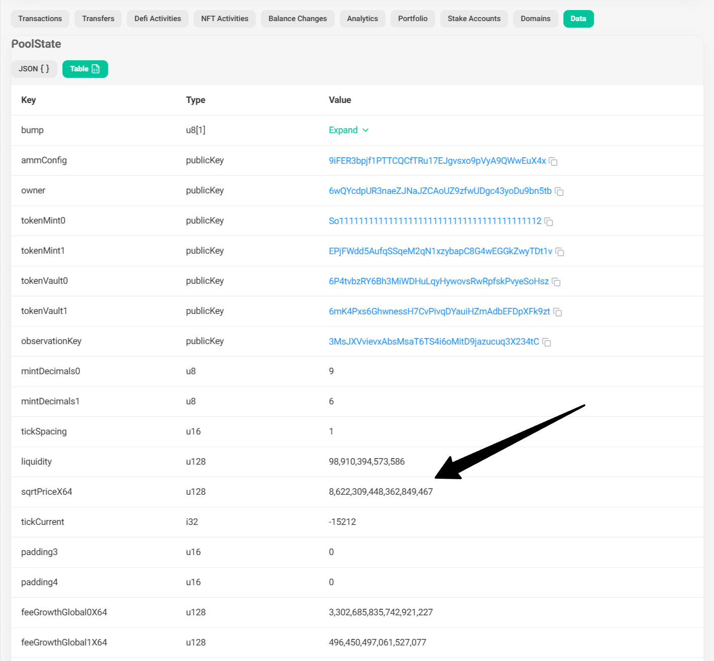
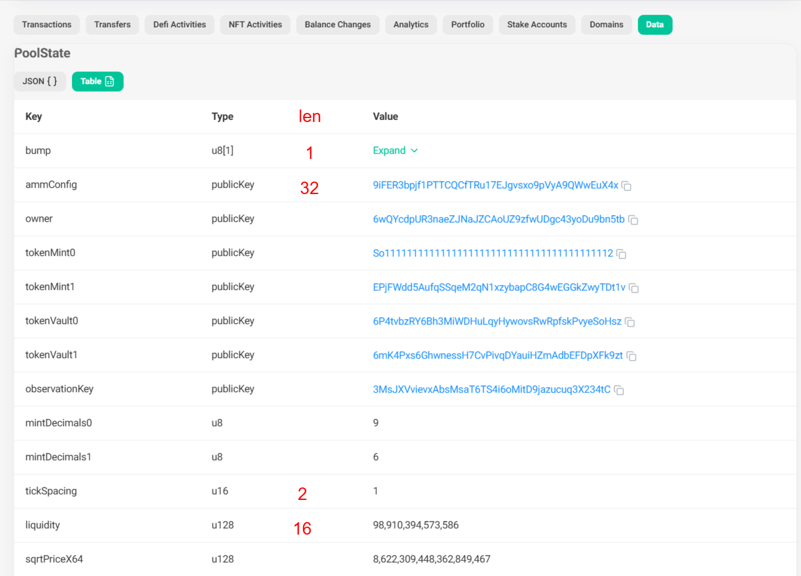

# 解析buffer

解析buffer实际上就是解析链上存储的原始二进制数据。

在一般情况下，我们其实并不清楚每段二进制数据的结构，而且往往我们只需要这段二进制数据中的某个字段。因此，此处将介绍手动解析链上二进制数据的方法，以获取raydium clmm WSOL/USDC流动池的WSOL价格为例，其地址为 `8sLbNZoA1cfnvMJLPfp98ZLAnFSYCFApfJKMbiXNLwxj`。

> 获取流动池价格在套利和流动性挖矿场景中经常使用。

## 解析WSOL/USDC流动池中WSOL的USDC相对价格

在raydium clmm协议流动池中，代币价格被显式保存在流动池账户地址的账户数据中，如下：



此处假定我们并不清楚存储数据的结构，而是使用手动解析的方法来获取此价格。

sqrtPriceX64的数据类型为 `u128`，占用16个字节。因此，只需要获取到sqrtPriceX64的起始偏移量（offset），往后取16字节进行解析即可。

其他数据类型的长度已在图中被标注，其中 `u8` 为1，`pubkey`为32，`u16`为2。

> 注意：在Solana的账户数据中，最初的8字节被用于前缀标识符（discriminator）。

所以，sqrtPriceX64的起始偏移量应为 $8 + 1 + 32*7 + 1 + 1 + 2 + 16 = 253$



```ts
import { Connection, PublicKey } from '@solana/web3.js';
import BN from 'bn.js';

// 创建RPC连接
const connection = new Connection("https://api.mainnet-beta.solana.com", "confirmed");

async function main() {

    const poolAccountPublicKey = new PublicKey('8sLbNZoA1cfnvMJLPfp98ZLAnFSYCFApfJKMbiXNLwxj');
    const accountInfo = await connection.getAccountInfo(poolAccountPublicKey);
    const dataBuffer = accountInfo?.data;
    if (!dataBuffer) {
        throw new Error("Account data not found");
    }
    console.log(dataBuffer)

    const offset = 253
    const sqrtPriceX64Buffer = dataBuffer.slice(offset, offset + 16); // 读取16个字节
    const sqrtPriceX64Value = new BN(sqrtPriceX64Buffer, 'le'); // 使用小端字节序创建BN实例
    console.log(`sqrtPriceX64Value at offset ${offset}:`, sqrtPriceX64Value.toString());

    // 计算价格
    const sqrtPriceX64BigInt = BigInt(sqrtPriceX64Value.toString());
    const sqrtPriceX64Float = Number(sqrtPriceX64BigInt) / (2 ** 64);
    const price = sqrtPriceX64Float ** 2 * 1e9 / 1e6;
    console.log(`WSOL价格:`,  price.toString())
}

main();
```

通过 `npx esrun 09-buffer/index.ts` 运行，输出应如下：

```
<Buffer f7 ed e3 f5 d7 c3 de 46 fb 81 6e 66 63 0c 3b b7 24 dc 59 e4 9f 6c c4 30 6e 60 3a 6a ac ca 06 fa 3e 34 e2 b4 0a d5 97 9d 8d 58 3a 6b bb 1c 51 0e f4 3f ... 1494 more bytes>
sqrtPriceX64Value at offset 253: 8622437757683733036
WSOL价格: 218.4845296506469
```